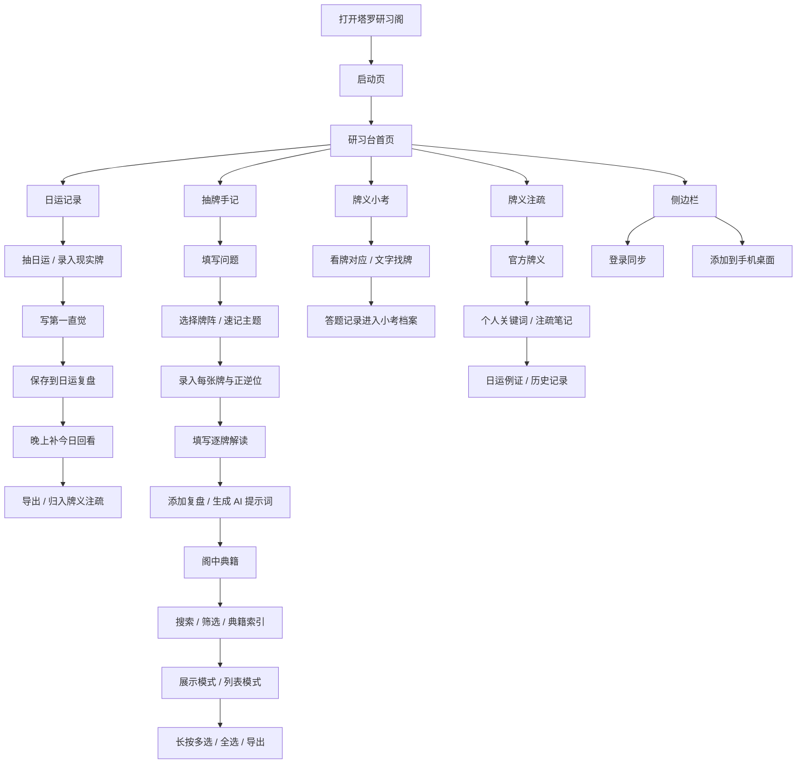

# 塔罗研习阁原型说明文档（PPT 素材版）

> 版本：V2  
> 更新时间：2026-08-03  
> 适用场景：AI 产品经理作品集、PRD 附录、面试项目讲解、产品原型展示  
> 原型来源：基于当前 Web / PWA 已上线与本地迭代版本整理。  
> 使用方式：本文的「PPT 可粘贴文案」可直接复制进幻灯片；「贴图建议」用于指导每页放哪些页面截图。

---

## 1. 项目一句话

塔罗研习阁是一款面向塔罗学习者的 Web / PWA 工具，帮助用户把日常抽牌、牌阵手记、复盘、牌义注疏和小考练习沉淀成自己的塔罗学习体系。

它不把塔罗包装成一次性的娱乐结果，而是把“记录—回看—归档—复盘—再学习”做成一个轻量闭环。

### PPT 可粘贴文案

塔罗研习阁是一款面向塔罗学习者的 AI 辅助研习工具，核心目标是帮助用户长期记录牌面、完成复盘、沉淀个人牌义，并通过轻量小考和典籍索引提升学习效率。

---

## 2. 产品定位

### 2.1 目标用户

- 塔罗初学者：需要稳定记录练习过程，逐步建立牌义理解。
- 有一定基础的塔罗学习者：需要回看历史案例，形成自己的解读体系。
- 会为他人占卜的用户：需要区分个人记录与客户记录，并保留复盘资料。
- 手机端高频用户：常在通勤、睡前、日常抽牌后快速记录。

### 2.2 用户核心痛点

| 痛点 | 表现 | 产品回应 |
| --- | --- | --- |
| 记录零散 | 抽牌结果散落在聊天、相册、纸本里 | 用结构化手记保存问题、牌阵、牌面和解读 |
| 复盘困难 | 过几天想不起当时为什么这么解 | 支持日运回看、普通手记复盘、导出 |
| 牌义难沉淀 | 每次都重新查牌义，个人理解没有积累 | 用牌义注疏承接关键词、例证、历史记录 |
| 手机端操作重 | 输入框、按钮、弹窗太大或太分散 | 手机优先，紧凑、轻量、减少误触 |
| 不会写 AI 提示词 | 给 AI 信息不完整，解读质量不稳定 | 自动根据记录生成可复制的解牌提示词 |

### PPT 可粘贴文案

目标用户不是只想“看一个答案”的泛娱乐用户，而是希望持续练习、回看和沉淀的塔罗学习者。因此产品的重点不是制造神秘感，而是降低记录成本、提升复盘效率，并帮助用户形成自己的牌义体系。

---

## 3. 核心产品闭环

### PPT 可粘贴文案

产品围绕三条主线形成闭环：  
第一，日运从“当日直觉”走向“晚上回看”；第二，普通抽牌从“记录”走向“典籍复盘”；第三，牌义学习从“查牌”走向“注疏与小考”。AI 提示词和云端同步作为辅助能力嵌入关键节点，而不是喧宾夺主。

---

## 4. 信息架构

| 一级入口 | 用户目的 | 主要功能 |
| --- | --- | --- |
| 启动页 | 建立品牌调性，进入应用 | 开启研习 |
| 研习台 | 日常使用入口 | 日运、小考、典籍入口、牌义注疏入口 |
| 记录 | 新建抽牌手记 | 问题、日期、标签、牌阵、牌面、解读、复盘 |
| 典籍 | 回看历史记录 | 搜索、筛选、索引、展示/列表、导出 |
| 广场 | 浏览公开案例 | 公开手记、案例查看 |
| 侧边栏 | 全局能力 | 登录同步、昵称、PWA 添加桌面、数据状态 |

### PPT 可粘贴文案

信息架构以“高频记录在底部导航、低频账户能力在侧边栏”为原则。首页只保留日常最常用的入口；典籍承担知识库能力；牌义注疏承担长期沉淀；小考承担轻量练习。

---

## 5. 原型总览与贴图建议

| PPT 页 | 建议截图 | 截图重点 |
| --- | --- | --- |
| 1. 产品封面 | 启动页整屏 | App 名称、slogan、进入按钮、品牌氛围 |
| 2. 首页总览 | 研习台手机端整屏 | 日运与小考尽量同屏展示 |
| 3. 日运记录 | 日运抽牌 + 记录弹窗 | 第一直觉 / 今日回看 |
| 4. 日运复盘 | 日运复盘弹窗 | 时间线、按牌、本月、导出、归入注疏 |
| 5. 抽牌手记 | 新建手记页 | 问题、日期、标签、速记主题、牌阵 |
| 6. 牌阵与画布 | 自由画布 / 官方牌阵 | 画布、缩放、拖拽、自建牌阵 |
| 7. 添加复盘 | 复盘区 + AI 提示词 | 导师复盘 / 咨询解牌 |
| 8. 阁中典籍 | 展示模式 | 高密度浏览、牌阵缩略图 |
| 9. 典籍索引 | 索引面板 | 按牌、按牌阵、按标签、按问题 |
| 10. 批量导出 | 长按多选状态 | 全选当前、导出 PDF / 表格 |
| 11. 牌义注疏 | 牌义库两行半视图 | 批量编辑、成册、搜索、筛选 |
| 12. 单牌详情 | 单牌详情页 | 官方牌义、个人笔记、日运例证 |
| 13. 牌义小考 | 首页小考 | 看牌对应 / 文字找牌 / 换题 |
| 14. 小考档案 | 档案面板 | 今日、累计、正确率、待温习、最近练习 |
| 15. 侧边栏同步 | 侧边栏 | 登录同步、添加桌面、数据保险箱 |

### PPT 可粘贴文案

原型展示建议按“进入产品—完成记录—沉淀复盘—持续练习—数据安全”的顺序展开。这样既能体现完整用户路径，也能对应产品经理岗位中的需求分析、功能设计、原型表达和体验迭代能力。

---

## 6. 页面原型详解

### 6.1 启动页

#### 页面目标

- 作为用户打开应用后的第一印象，建立“晨光手札、安静研习”的品牌调性。
- 用短文案表达产品主张：用户不是被动学习塔罗，而是在构建自己的体系。

#### 核心组件

- App 图标
- 主标题：塔罗研习阁
- Slogan：你的塔罗，自有体系。
- 功能说明：记录·注疏·布阵，构建你的个人手札。
- 主按钮：开启研习

#### 关键交互

- 点击“开启研习”进入研习台。
- 不承载注册、广告或复杂导览，保持低压力。

#### 贴图建议

- 放一张手机端启动页整屏截图。
- 如果做 PPT，可在右侧补一句短标注：`第一屏先建立气质，不急着塞功能。`

#### PPT 可粘贴文案

启动页承担产品气质建立：用暖白背景、轻几何水印和简短文案传达“低压力、可长期使用”的感受。用户点击“开启研习”后进入研习台，不在第一步制造登录或学习负担。

---

### 6.2 研习台首页

#### 页面目标

- 让用户一打开就知道今天能做什么。
- 把“日运记录”和“牌义小考”放在首屏附近，降低每日使用门槛。

#### 核心组件

- 今日研习卡：先抽日运，再把记录变成复盘。
- 日运入口：洗牌、录入现实牌、日运复盘。
- 统计小卡：日运、手记、已复盘、牌面。
- 典籍 / 牌义注疏快捷入口。
- 牌义小考直答卡。

#### 关键交互

- 洗牌：随机抽出今日日运。
- 现实牌：用户线下已抽牌时，可直接录入。
- 复盘：进入日运历史与导出。
- 小考：无需进入二级页面，首页直接答一题。

#### 贴图建议

- 手机端贴一张能同时看到日运与小考开头的截图。
- 桌面端贴一张全局布局截图，展示首页如何承载多个入口但不显拥挤。
- 截图标注建议：用 3 个编号标出 `日运入口`、`学习沉淀入口`、`轻量小考`。

#### PPT 可粘贴文案

研习台不是功能列表，而是每日使用的起点。首页优先放日运入口，帮助用户先完成最小记录；同时保留小考和典籍入口，让记录、复盘和学习自然衔接。

---

### 6.3 日运记录

#### 页面目标

- 适配真实日运习惯：白天先写第一眼感受，晚上再回来看今天发生了什么。
- 避免用户把所有内容挤在一个输入框里，降低复盘成本。

#### 核心组件

- 今日牌面展示。
- 正逆位切换。
- 第一直觉输入框。
- 今日回看输入框。
- 快捷空状态：今天暂未看见明显对应。
- 保存到日运复盘。

#### 关键交互

- 用户抽牌后可马上填写“第一直觉”。
- 晚上可再次进入补写“今日回看”。
- 保存后进入日运复盘，后续可导出或归入注疏。

#### 贴图建议

- 贴一张日运记录弹窗截图。
- 建议用红线或浅色框标出两个输入区：`第一直觉` 和 `今日回看`。
- 如果 PPT 空间有限，只贴弹窗局部，不必放完整首页。

#### PPT 可粘贴文案

日运记录拆成“第一直觉 / 今日回看”，贴合用户一天中的两次记录动作：先记录看到牌面的直觉，晚上再补真实对应。这样既保留即时感，也让复盘更清晰。

---

### 6.4 日运复盘

#### 页面目标

- 让日运从单日记录变成可回看的学习资料。
- 支持按时间、按牌、本月统计复盘，帮助用户发现反复出现的主题。

#### 核心组件

- 时间线：查看每天的日运记录。
- 按牌：查看某张牌历史出现情况。
- 本月：查看本月牌频排行。
- 导出：PDF / 表格。
- 归入牌义注疏：将精选日运作为单牌例证保存。

#### 关键交互

- 用户可补写日运记录。
- 可将有价值的记录归入某张牌的例证区。
- 可导出带昵称和日期的复盘文件。

#### 贴图建议

- 贴一张日运复盘弹窗整屏截图。
- 再贴一张“归入牌义注疏”按钮局部。
- 如果要体现数据能力，可补本月牌频截图。

#### PPT 可粘贴文案

日运复盘把每天一张牌变成长期样本库。用户既能按时间回看，也能按牌聚合，还能把精选日运沉淀到牌义注疏里，完成从日常记录到个人牌义体系的转化。

---

### 6.5 抽牌手记

#### 页面目标

- 支持用户完成一次完整占卜记录。
- 按真实流程组织字段：先明确问题，再选择牌阵，最后记录每张牌和解读。

#### 核心组件

- 记录对象切换：为自己 / 客户。
- 占卜问题。
- 日期。
- 标签。
- 速记主题。
- 牌阵选择。
- 牌面录入。
- 逐牌解读。
- 添加复盘。

#### 关键交互

- 客户模式下需要填写客户姓名。
- 必填信息未完成时阻止保存，并用温和提示说明缺什么。
- 牌面默认选择后，再在外部统一切换正逆位，减少选牌时的干扰。

#### 贴图建议

- 贴一张手机端新建手记页截图。
- 重点截上半部分：对象切换、问题、日期、标签、速记主题、牌阵。
- 如果做流程展示，再贴一张已经录入牌面的状态。

#### PPT 可粘贴文案

抽牌手记把一次占卜拆成结构化信息：问题、对象、日期、标签、牌阵、牌面和逐牌解读。这样用户保存后，不只是留下结果，而是留下未来可以复盘的上下文。

---

### 6.6 牌阵选择与自由画布

#### 页面目标

- 满足两类用户：直接使用官方牌阵，以及在已有牌阵基础上自定义改造。
- 让用户在手机端也能自由摆放、缩放和调整布局。

#### 核心组件

- 官方牌阵选择。
- 自建牌阵管理。
- 基于已有牌阵改造。
- 自由画布。
- 缩放、拖拽、对齐、清空。
- 长按删除某个抽位。

#### 关键交互

- 点击新建牌阵后直达自由画布，不再多一步“开始摆放”。
- 用户可选择空白创建，也可基于已有牌阵改造。
- 手机端画布应占据主要屏幕空间，减少顶部说明与按钮占比。

#### 贴图建议

- 贴一张自由画布手机端截图。
- 如果要展示交互复杂度，可补桌面端自由画布截图，说明桌面适合精细拖拽。
- 截图标注建议：`画布区域`、`缩放控制`、`保存并使用`。

#### PPT 可粘贴文案

牌阵功能兼顾标准化与自由创作：用户既可以直接使用官方牌阵，也可以在已有结构上改造，或从空白画布开始自由摆放。自由画布强化“研习工具”的属性，而不是只做固定模板。

---

### 6.7 添加复盘与 AI 解牌提示词

#### 页面目标

- 把 AI 放在复盘阶段，作为用户整理思路和补充视角的工具。
- 帮不会写提示词的用户自动生成高质量上下文。

#### 核心组件

- 复盘输入框。
- AI 解牌提示词卡。
- 模式切换：导师复盘 / 咨询解牌。
- 生成提示词。
- 复制提示词。
- 补充解读视角：灵数、行星星座、宫位、元素。

#### 关键交互

- 默认不显示缺失警告。
- 用户点击生成时才校验关键信息。
- 导师复盘模式会带上用户自己的逐牌解读。
- 咨询解牌模式只给问题、牌阵和牌面，让外部 AI 像塔罗师接咨询一样解读。

#### 贴图建议

- 贴一张添加复盘区域截图。
- 再贴一张已生成提示词的文本框截图。
- 建议标注两种模式的差异：`导师复盘 = 看我的解读`，`咨询解牌 = 直接看牌面`。

#### PPT 可粘贴文案

AI 提示词不是直接替用户解牌，而是把用户已经填写的信息整理成清晰上下文。用户可以选择“导师复盘”让 AI 帮自己检查解读，也可以选择“咨询解牌”让 AI 直接基于问题、牌阵和牌面给出分析。

---

### 6.8 阁中典籍

#### 页面目标

- 把历史抽牌手记沉淀成可浏览、可检索、可导出的个人知识库。
- 支持高密度浏览，避免一条记录占据过多屏幕空间。

#### 核心组件

- 搜索框。
- 筛选。
- 典籍索引。
- 展示 / 列表切换。
- 展示模式：保留牌阵缩略图。
- 列表模式：只展示必要信息。
- 长按进入多选。
- 全选当前。
- 批量导出。

#### 关键交互

- 默认进入展示模式，让用户第一眼看到牌阵缩略图。
- 手机端长按进入多选；桌面端可通过显性选择入口进入批量操作。
- 删除等危险操作不外露，避免误触。

#### 贴图建议

- 贴一张展示模式截图，强调一屏可以看见多个记录。
- 贴一张列表模式截图，强调高密度浏览。
- 贴一张多选状态截图，展示全选当前和批量导出。

#### PPT 可粘贴文案

阁中典籍从“记录列表”升级为个人知识库。展示模式适合视觉回看，列表模式适合快速检索；多选、全选和导出能力满足用户长期复盘与资料整理需求。

---

### 6.9 典籍索引

#### 页面目标

- 让用户快速找回“某张牌出现过的记录”“某个牌阵的记录”“某个标签下的记录”。
- 不依赖 AI 自动分类，优先使用用户真实填写的信息。

#### 核心组件

- 按牌索引。
- 按牌阵索引。
- 按标签索引。
- 按问题文本搜索。
- 当前索引条件提示。
- 清除筛选。

#### 关键交互

- 点击索引项后回到典籍列表，并应用筛选。
- 顶部显示当前筛选条件，用户可一键清除。
- 标签只来自用户手动填写，避免自动关键词造成误判。

#### 贴图建议

- 手机端贴底部抽屉样式。
- 桌面端可贴右侧轻面板样式。
- 建议标注四类索引：`牌`、`牌阵`、`标签`、`问题`。

#### PPT 可粘贴文案

典籍索引解决的是“记录多了以后怎么找回来”的问题。V1 不做复杂 AI 分类，而是先基于已有结构化数据建立可靠索引，让用户能按牌、牌阵、标签和问题快速回看。

---

### 6.10 牌义注疏

#### 页面目标

- 让用户围绕每一张牌沉淀个人理解。
- 把官方资料、个人关键词、日运例证和历史记录放在同一个学习语境里。

#### 核心组件

- 牌库总览。
- 批量编辑。
- 撰录成册。
- 搜索与筛选。
- 网格 / 列表切换。
- 单牌卡片。

#### 关键交互

- 手机端牌卡需要高密度展示，打开页面至少看到两行以上内容。
- 点击单牌后进入更合适的详情模式，而不是在原地撑开造成大面积空白。
- 用户可以编辑个人关键词和牌义笔记。

#### 贴图建议

- 贴一张牌义库网格截图，展示两行以上牌卡。
- 贴一张单牌详情截图，展示官方牌义、个人笔记、日运例证。
- 如果做对比页，可以放“总览 → 单牌详情”的转场示意。

#### PPT 可粘贴文案

牌义注疏是用户建立个人塔罗体系的核心页面。它不只是查牌义，而是把官方资料、个人关键词、日运样本和历史记录汇总到每一张牌下，帮助用户形成长期记忆。

---

### 6.11 单牌详情

#### 页面目标

- 帮用户围绕一张牌完成深度学习。
- 展示这张牌的基础信息、个人笔记、日运例证和出现历史。

#### 核心组件

- 牌面大图。
- 中文名 / 英文名。
- 元素、行星、星座、宫位等体系信息。
- 官方正逆位含义。
- 我的牌义笔记。
- 日运例证。
- 日运历史。
- 研习历程。

#### 关键交互

- 输入框高度随文字增长，不用预留过长空白。
- 空状态保持安静提示，不做大面积系统占位。
- 点击保存后使用轻提示，不打断阅读。

#### 贴图建议

- 贴一张单牌详情顶部截图。
- 再贴一张个人笔记与日运例证区域截图。
- 建议标注“官方资料”和“个人沉淀”的分层。

#### PPT 可粘贴文案

单牌详情页把“查资料”和“写自己的理解”放在一起。用户既能看到基础体系对应，也能保留自己的关键词、注疏和真实案例，从而逐步建立个人牌义库。

---

### 6.12 牌义小考

#### 页面目标

- 用轻量游戏化方式帮助用户记忆体系对应。
- 首页直接答题，不让用户感觉进入沉重训练任务。

#### 核心组件

- 看牌对应 / 文字找牌切换。
- 当前题目。
- 牌面或含义提示。
- 选项。
- 换题。
- 答题反馈。
- 档案入口。

#### 关键交互

- 看牌对应：看一张牌，选择元素、行星、星座或宫位。
- 文字找牌：看一段含义，选择最接近的牌面。
- 答错自动进入待温习。
- 答题后展示正确答案与体系线索。

#### 贴图建议

- 贴一张“看牌对应”题目截图。
- 贴一张“文字找牌”题目截图。
- 贴一张答题后反馈截图，展示正确答案与体系线索。

#### PPT 可粘贴文案

牌义小考保留轻量直答体验：用户不用进入复杂训练中心，在首页就能完成一题。默认从牌面出发强化视觉记忆，同时保留文字找牌用于反向练习。

---

### 6.13 小考档案

#### 页面目标

- 让“档案”真正承载练习回顾，而不是只是筛选设置。
- 用户可以看到自己练过什么、哪些还不熟、最近错在哪里。

#### 核心组件

- 今日练习数。
- 累计练习数。
- 正确率。
- 待温习数量。
- 最近练习记录。
- 最近不熟的牌。
- 专项设置入口。
- 待温习入口。

#### 关键交互

- 档案中不再直接展示考试题目。
- 用户可从档案进入待温习。
- 专项设置用于控制首页题库范围，但不挤占首页空间。

#### 贴图建议

- 贴一张小考档案面板截图。
- 重点标出：`练习统计`、`待温习`、`最近练习`、`专项设置`。
- 如果空间有限，不需要展示题目，只展示档案信息本身。

#### PPT 可粘贴文案

小考档案承担练习回顾功能：用户不仅能做题，还能看到练习次数、正确率、待温习和最近不熟的牌。专项设置被收进档案，首页保持轻巧。

---

### 6.14 侧边栏、登录与同步

#### 页面目标

- 承载全局账户能力和低频设置。
- 保障用户数据安全感，尤其是本地记录与云端同步状态。

#### 核心组件

- 登录入口。
- 昵称与账户信息。
- 数据保险箱。
- 同步状态。
- 重新同步。
- 添加到手机桌面。

#### 关键交互

- 侧边栏点击登录后直接进入登录页面，不增加无意义中间页。
- 本地优先保存，云端失败不影响本地记录。
- 同步失败时给出可理解的状态，而不是直接让用户恐慌。
- 完成一次记录后，可温和提示用户添加到桌面。

#### 贴图建议

- 贴一张侧边栏截图。
- 贴一张登录 / 同步状态截图。
- 贴一张 PWA 添加桌面的提示截图。

#### PPT 可粘贴文案

账户和同步被放在侧边栏，避免挤占底部主导航。产品采用本地优先保存、登录后同步云端的策略，让用户即使遇到网络问题，也不会丢失已经写下的记录。

---

### 6.15 底部导航

#### 页面目标

- 保留用户最常用的四个主路径。
- 手机端固定在底部，减少找入口成本。

#### 核心组件

- 研习台
- 记录
- 典籍
- 广场

#### 设计理由

- “印鉴 / 账户”不放底部导航，避免主路径过多。
- 底部栏保持轻薄，减少页面底部厚重感。

#### 贴图建议

- 贴一张手机端底部导航截图。
- 可在 PPT 上用小标注说明：`四个高频入口固定，低频账户功能收进侧边栏。`

#### PPT 可粘贴文案

底部导航只保留高频主路径：研习台、记录、典籍、广场。账户、同步和添加桌面等低频能力收进侧边栏，让主导航更清晰。

---

## 7. 关键交互规则

### 7.1 手机端返回

- 非首页：返回上一层或关闭当前弹窗 / 面板。
- 首页：第一次返回给轻提示，再按一次退出。
- 目的：避免用户误触后直接退出 PWA。

### 7.2 多选与删除

- 手机端：长按记录进入多选。
- 桌面端：保留更明确的多选入口。
- 全选：支持全选当前筛选结果。
- 删除：危险操作不直接暴露在展示模式外层，避免误触。

### 7.3 输入框

- 输入框高度随内容增长。
- 不为空白输入预留过长区域。
- 手机端优先保持一屏可读，减少大留白。

### 7.4 AI 提示词

- 不在打开复盘时提前报错。
- 用户点击生成后，再温和提示缺少哪些信息。
- 信息完整后生成可复制提示词。

### 7.5 PWA

- 用户完成一次记录后出现添加桌面提示。
- 侧边栏保留添加桌面入口。
- 添加到桌面后应显示正确图标和名称。

### PPT 可粘贴文案

交互设计重点围绕手机端真实使用：返回防误触、长按进入多选、危险操作后置、输入框随内容增长、AI 提示在用户主动点击后出现。这些细节让工具更像长期使用的手札，而不是一次性的表单。

---

## 8. 视觉与组件规范

### 8.1 视觉关键词

- 暖白奶油色背景
- 鼠尾草绿主色
- 杏仁粉点缀
- 半透明薄卡片
- 弱边框、弱阴影
- 适度花纹，远离按钮和小卡片
- 紧凑、秀气、可读

### 8.2 排版

- 标题：宋体 / serif，强调古典感。
- 正文：无衬线，保证阅读效率。
- 按钮：字重不宜过粗，避免压迫感。
- 数字：优先使用阿拉伯数字，例如第0宫。

### 8.3 卡片

- 同级卡片保持同一底色体系。
- 不在小卡片和按钮附近堆花纹。
- 大区块可保留淡水印，增强品牌记忆。
- 批量阅览页优先保证信息密度。

### PPT 可粘贴文案

视觉设计不是简单“变素”，而是在轻透和识别度之间取平衡：大区块保留品牌花纹，小卡片保持干净；按钮降低厚重感，内容区提高可读性，让用户愿意长期打开。

---

## 9. 适合放进 PPT 的页面顺序

### 推荐 12 页版

1. 封面：塔罗研习阁，一句话定位  
2. 用户痛点：记录零散、复盘困难、不会写 AI 提示词  
3. 产品闭环：记录—复盘—注疏—小考  
4. 首页原型：日运与小考作为每日入口  
5. 日运原型：第一直觉 / 今日回看  
6. 抽牌手记原型：结构化记录一次占卜  
7. AI 提示词原型：导师复盘 / 咨询解牌  
8. 阁中典籍原型：展示、列表、索引、导出  
9. 牌义注疏原型：官方资料与个人沉淀  
10. 牌义小考原型：轻量直答与档案  
11. 账户同步与 PWA：数据安全和手机桌面入口  
12. 迭代复盘：从用户反馈推动体验优化

### 推荐 18 页详版

1. 项目封面  
2. 岗位匹配：为什么这是一个 AI 产品项目  
3. 用户画像  
4. 用户痛点  
5. 产品定位  
6. 信息架构  
7. 核心流程图  
8. 启动页  
9. 研习台首页  
10. 日运记录  
11. 日运复盘  
12. 抽牌手记  
13. 自由画布与牌阵  
14. AI 提示词  
15. 阁中典籍  
16. 典籍索引与导出  
17. 牌义注疏  
18. 牌义小考与小考档案

---

## 10. 贴图方法建议

### 10.1 手机端截图

适合展示：

- 高频使用路径。
- 日运、记录、典籍、小考等移动端核心体验。
- 紧凑性和触控设计。

建议样式：

- 每页放 1 张大手机截图 + 2 到 3 个文字标注。
- 不要每页塞太多小图，否则看不清。
- 关键交互可用红框、箭头或编号轻标注。

### 10.2 桌面端截图

适合展示：

- 整体布局。
- 批量阅览。
- 自由画布。
- 牌义库批量编辑。

建议样式：

- 用宽屏截图展示整体结构。
- 配合局部放大图说明关键按钮。

### 10.3 前后对比截图

适合展示迭代能力：

- 塔罗牌加载慢 → 本地静态资源与预加载。
- 日运换行丢失 → 保留换行并拆分字段。
- 典籍卡片过大 → 展示 / 列表两种模式。
- 删除按钮外露 → 长按多选后再批量操作。
- AI 提示词提前报错 → 点击后再温和校验。

### PPT 可粘贴文案

原型截图建议以手机端为主，因为产品的真实使用场景更接近移动端。桌面端用于展示信息密度、批量操作和自由画布等复杂能力。若要体现产品经理迭代能力，可加入“问题—调整—结果”的前后对比图。

---

## 11. 作品集讲述重点

| JD 能力点 | 原型中可展示的证据 |
| --- | --- |
| 需求分析 | 从用户记录、复盘、移动端使用和 AI 提示词问题中拆解需求 |
| 功能设计 | 日运、手记、典籍、注疏、小考形成学习闭环 |
| 原型能力 | 手机端高保真页面、流程图、页面说明、交互规则 |
| AI 应用 | 提示词生成辅助用户使用外部 AI，不替代用户判断 |
| 项目跟进 | 根据真实反馈持续修正布局、同步、导出、PWA 和交互 |
| 测试交付 | 本地预览、移动端截图、Cloudflare Pages 部署、云端规则检查 |

### PPT 可粘贴文案

这个项目可以重点展示我对需求拆解、功能闭环、AI 辅助边界和用户反馈迭代的理解。相比单纯做一个工具页面，我更关注用户能否持续使用、能否找回历史记录、能否在长期使用中形成自己的知识体系。

---

## 12. 可补充的原型截图清单

如果后续继续完善作品集，建议补拍这些图：

- 首页：日运与小考同屏状态。
- 日运：记录弹窗、复盘弹窗、本月牌频。
- 记录：单牌阵、选择牌阵、自由画布、自建牌阵。
- AI：导师复盘提示词、咨询解牌提示词。
- 典籍：展示模式、列表模式、索引面板、多选导出。
- 牌义注疏：牌库总览、单牌详情、个人笔记、日运例证。
- 小考：看牌对应、文字找牌、答题反馈、小考档案。
- 侧边栏：登录同步、添加桌面、数据保险箱。

### PPT 可粘贴文案

后续补图优先覆盖三类场景：核心路径图、关键交互图、迭代对比图。核心路径图证明产品完整性，关键交互图证明原型细节，迭代对比图证明产品经理的反馈闭环能力。

---

## 13. 一分钟讲述版

塔罗研习阁是我围绕塔罗学习场景做的一款 Web / PWA 工具。它的核心不是给用户一个即时答案，而是帮助用户把抽牌、记录、复盘和牌义沉淀串成长期学习闭环。  

产品里有三条主线：第一是日运，用户可以白天写第一直觉，晚上补今日回看；第二是抽牌手记，用户记录问题、牌阵、牌面和逐牌解读，再进入阁中典籍检索和导出；第三是牌义注疏和小考，帮助用户围绕每张牌沉淀个人理解，并用轻量题目持续记忆。  

AI 部分我没有做成替用户下结论，而是放在复盘阶段生成高质量提示词，用户可以复制给自己信任的 AI，用作导师复盘或咨询解牌。整个项目重点体现了需求拆解、原型设计、移动端体验优化、用户反馈迭代和 AI 能力边界设计。

---

## 14. 简历项目经历压缩版

**塔罗研习阁｜AI 辅助塔罗研习 Web / PWA 工具**  

- 独立参与产品定位、需求拆解、功能规划、交互优化与上线迭代，围绕塔罗学习者的记录、复盘和牌义沉淀需求设计产品闭环。
- 设计日运记录、抽牌手记、阁中典籍、牌义注疏、牌义小考和 AI 解牌提示词等核心模块，支持移动端高频记录与长期知识库沉淀。
- 基于用户反馈持续优化：日运字段拆分、换行保留、典籍索引、多选导出、PWA 添加桌面、云端同步提示、移动端布局紧凑化等。
- 探索 AI 在垂直学习工具中的应用边界，通过提示词生成辅助用户复盘和解读，不替代用户判断，提升使用效率与体验稳定性。

