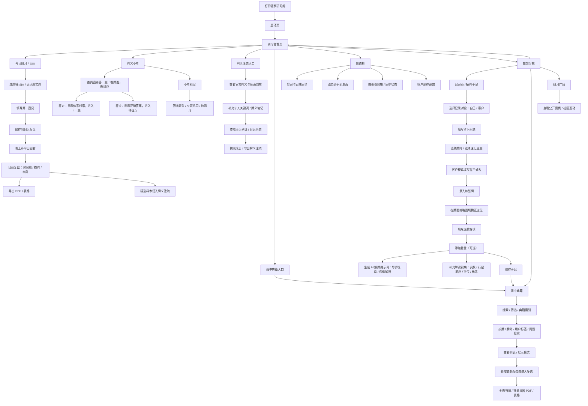

# 塔罗研习阁用户流程图

> 更新时间：2026-07-29  
> 用途：作品集 / PRD / 产品复盘中的核心流程图  
> 说明：此版本按当前软件功能梳理，把“日运记录—复盘—牌义沉淀”“抽牌手记—典籍索引—导出”“牌义小考—待温习”几条主线拆清楚，避免把重复入口画成独立功能。

## 这版相对原图的主要修正

1. “典籍复盘”不再画成研习台下的独立大功能，而是归到“阁中典籍”的搜索、筛选、索引、导出能力里。这样更符合现在的软件结构，也避免和底部导航里的“典籍”重复。
2. “抽牌手记”从底部导航的“记录页”进入，不直接挂在研习台主流程下；研习台更像日常入口和快捷入口。
3. 日运流程改成“保存到日运复盘”，再补“今日回看”，最后支持导出或归入牌义注疏，更贴近真实使用路径。
4. 抽牌手记补上了当前关键规则：客户模式要填客户姓名、录入后在外层切换正逆位、逐牌解读是保存前的关键内容。
5. AI 提示词拆成两种模式：`导师复盘` 和 `咨询解牌`，放在“添加复盘”里，更符合用户先记录、再复盘、再借助 AI 的行为。
6. 牌义小考保留首页直答，不再画成重型训练中心；专项、待温习和题型切换收进“小考档案”。
7. 侧边栏只保留全局辅助功能：登录同步、添加到手机桌面、数据保险箱、昵称设置。

